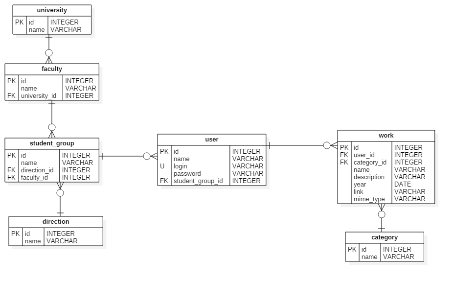
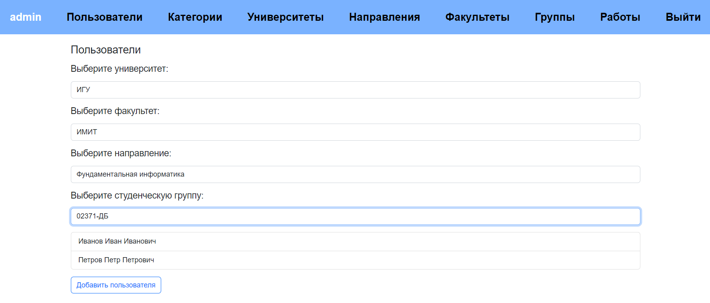
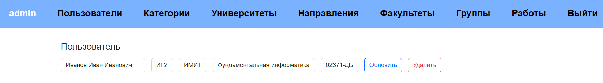
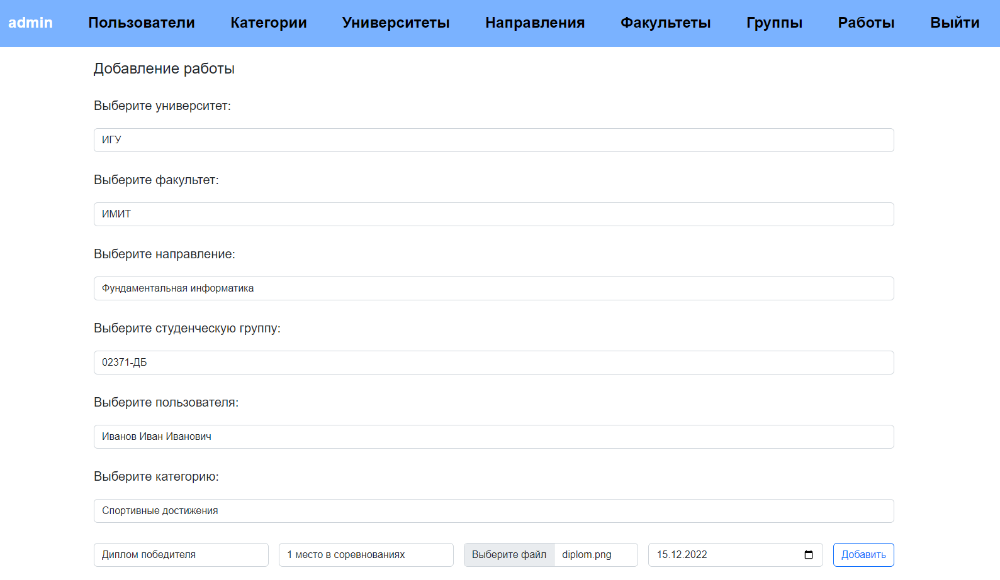
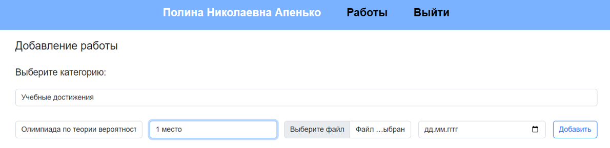
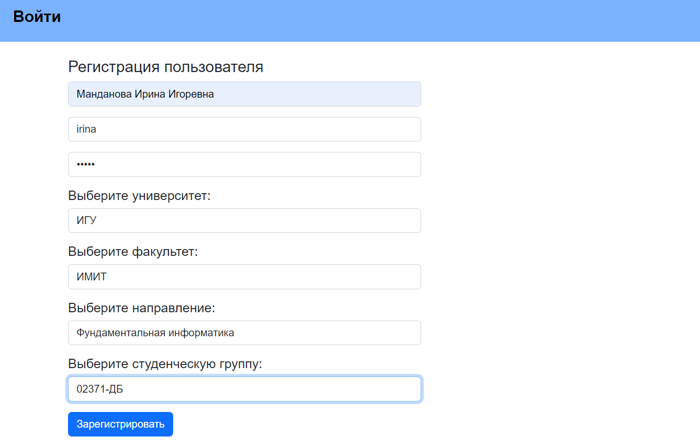
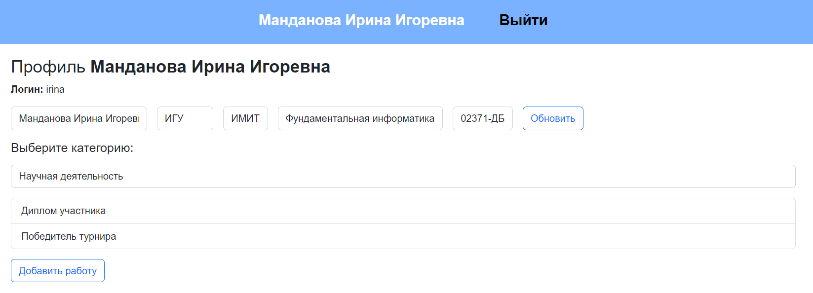
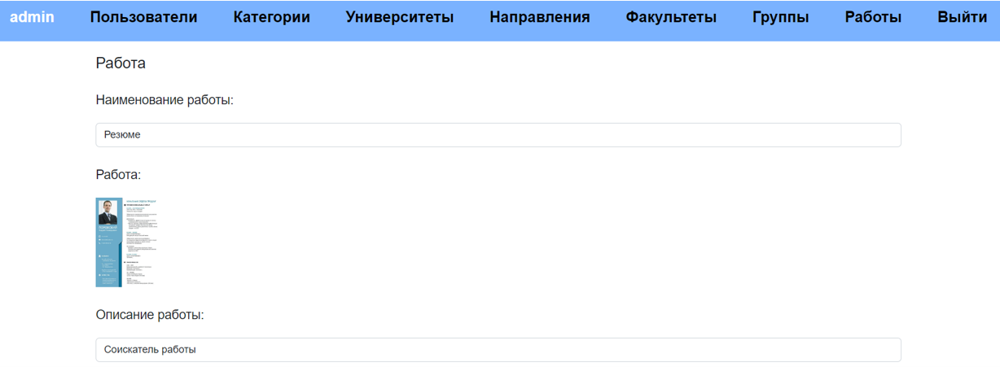

# Веб-приложение для системы электронного портфолио. 

Данное веб-приложение требуется для того, чтобы у студентов была возможность загружать результаты своих достижений по различным направлениям деятельности. Основными пользователями являются студенты, которые загружают свои документы, и преподаватели, которые могут просматривать эти документы. Студентам доступны лишь свои файлы, преподаватели имеют доступ ко всем данным системы, в том числе могут редактировать их. Незарегистрированные пользователи не могут просматривать страницы.

## Требования к проекту
1. Регистрация пользователя;
2. Вход пользователя в систему;
3. Наличие двух уровней доступа: администратор (преподаватель) и пользователь (студент);
4. Добавление/изменение/удаление/отображение направлений, университетов, факультетов, студенческих групп, пользователей, категорий и работ для администратора;
5. Личный кабинет пользователя для добавления/изменения/удаления/отображения его работ.

Схема базы данных к проекту «Система электронного портфолио» представлена на рисунке 1.

## Реализованная функциональность веб-приложения продемонстрирована далее в виде рисунков.
Вывод списка университетов осуществляется на странице, которая показана
на рисунке 2. Аналогично реализован вывод списков направлений и категорий.
Данные страницы доступны только администратору.

Вывод списка пользователей осуществляется на странице, которая показана
на рисунке 3. Для отображения списка необходимо последовательно выбрать по
одному пункту из каждого выпадающего списка. Аналогично реализован вывод
списков факультетов, студенческих групп и работ. Данные страницы доступны
только администратору.

Вывод информации о пользователе происходит на странице, которая показана на рисунке 4. Все данные могут быть изменены по желанию администратора.
Аналогично реализован вывод информации для определенного направления, университета, факультета, студенческой группы, категории и работы. Данные страницы доступны только администратору (страница работы доступна еще и пользователю).

Возможность добавления работы администратором осуществляется на странице, которая показана на рисунке 5.

Возможность добавления работы пользователем показана на рисунке 6.

Регистрация пользователя в системе осуществляется на странице, которая
показана на рисунке 7. В случае необходимости пользователь может изменить
информацию о себе в личном кабинете.

Показ личного кабинета пользователя осуществляется на странице, которая
показана на рисунке 8. Выбрав категорию, можно получить список работ пользователя, относящихся к данной категории. Пользователю доступен лишь личный
кабинет и свои работы.

Страница работы показана на рисунке 9.

